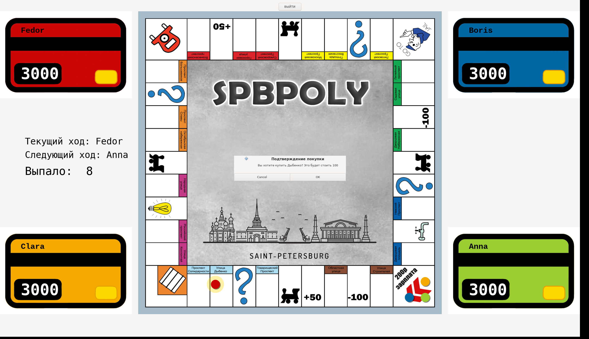

# SPbPoly

Настольная игра в духе «Монополии» по мотивам Санкт-Петербурга. Написана на C++ с графическим интерфейсом на gtkmm 3.



## Возможности

- До 4 игроков, у каждого своё имя и банковская карта со счётом
- 22 улицы Петербурга с реальными названиями, разбитые на цветовые группы
- Покупка улиц, прокачка уровня, рента, бонус за монополию цветовой группы
- 16 карточек «Шанс» — деньги, перемещения, спецэффекты
- Тюрьма и механика выхода из неё
- Пошаговая анимация перемещения фишки, подсветка целевой клетки
- Карточка улицы при наведении мышью

## Управление

| Действие | Клавиша |
|---|---|
| Бросок костей, подтверждение хода | `Пробел` |
| Информация об улице | Наведение мышью |
| Покупка / прокачка | Кнопки в диалоговых окнах |

## Сборка

Нужен компилятор с поддержкой C++17 и библиотека **gtkmm 3.0**.

### Windows (MSYS2)

1. Установите [MSYS2](https://www.msys2.org/).
2. В терминале MSYS2 MinGW 64-bit поставьте зависимости:

   ```bash
   pacman -S mingw-w64-x86_64-gcc mingw-w64-x86_64-gtkmm3 mingw-w64-x86_64-pkg-config
   ```

3. Соберите игру — двойным кликом по `compile.bat` либо командой:

   ```bash
   g++ -std=c++17 $(pkg-config --cflags gtkmm-3.0) "Upgrade Original.cpp" $(pkg-config --libs gtkmm-3.0) -o "Upgrade Original.exe"
   ```

4. Запустите `Upgrade Original.exe` из папки проекта.

Если MSYS2 установлен не в `C:\msys64`, поправьте пути в `compile.bat` и `.vscode/tasks.json`.

### Linux

```bash
sudo apt install g++ libgtkmm-3.0-dev pkg-config
./build.sh
./SPbPoly
```

### VS Code

В папке `.vscode` уже лежат `tasks.json` (сборка, <kbd>Ctrl</kbd>+<kbd>Shift</kbd>+<kbd>B</kbd>) и `launch.json` (отладка через gdb). Пути к MSYS2 в них тоже прописаны для `C:\msys64`.

## Запуск на другом компьютере без установки gtkmm

Собранный `.exe` требует рядом DLL-библиотеки GTK. Чтобы собрать переносимую папку, выполните в MSYS2 из каталога проекта:

```bash
./collect-dlls.sh "Upgrade Original.exe" dist
```

Скрипт скопирует `.exe`, все нужные DLL и папки с картинками в `dist/`. Эту папку можно переносить на компьютер без MSYS2.

> Учтите: GTK дополнительно требует загрузчики изображений (`lib/gdk-pixbuf-2.0`) и тему иконок. Скрипт копирует их, если находит в установке MSYS2.

## Структура проекта

```
SPbPoly/
├── Upgrade Original.cpp   — весь исходный код игры
├── compile.bat            — сборка под Windows (MSYS2)
├── build.sh               — сборка под Linux
├── collect-dlls.sh        — сборка переносимой папки для Windows
├── Streets/               — картинки поля и карточек улиц
├── Chances/               — картинки карточек «Шанс»
└── .vscode/               — конфигурация сборки и отладки
```

## Устройство кода

Весь код лежит в одном файле. Основные классы:

| Класс | Назначение |
|---|---|
| `RGB` | Цвет фишки игрока |
| `Chip` | Фишка: координаты, деньги, позиция на поле (0–39), статус тюрьмы |
| `Cell` | Клетка поля, содержит до 4 слотов под фишки |
| `Street` | Улица: владелец, уровень, цена, рента, цветовая группа |
| `Chance` | Карта «Шанс»: изменение денег, перемещение, спецэффекты |
| `Drawing_panel` | Отрисовка поля и фишек, вся логика хода |
| `mainWin` | Стартовое окно, выбор количества игроков |

Пути к картинкам относительные (`Streets/`, `Chances/`). При старте программа переходит в каталог своего исполняемого файла, поэтому запускать её можно из любого места.

## Известные шероховатости

- В окне ввода имени игрока клавиша <kbd>Enter</kbd> не подтверждает ввод — нужно нажимать кнопку «ОК».
- Идентификатор приложения `"SPbPoly"` не соответствует формату GTK (ожидается вид `org.example.SPbPoly`), из-за чего в консоль печатается предупреждение `GLib-GIO-CRITICAL`. На работу игры не влияет.

## Автор

Фёдор Деев
